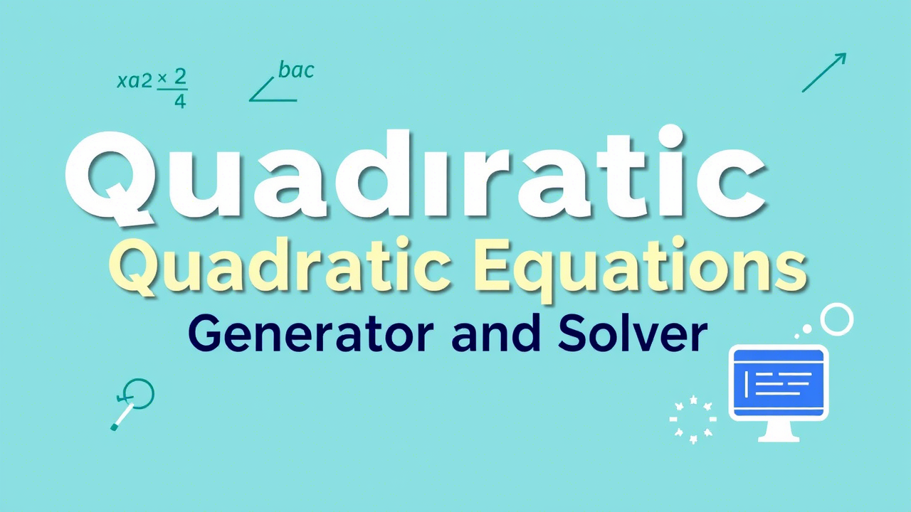

<div align="center">
  <a href="https://github.com/K1rsN7/SchoolProject/issues">
		
	</a>
	<a href="https://github.com/K1rsN7/SchoolProject/stargazers">
		
	</a>
	<a href="./LICENSE">
		
	</a>
</div>

# Quadratic Equations: Generator and Solver

## Project Description

This project was created as part of a school individual project in computer science during the 9th grade. The project is a Python program that allows generating quadratic equations with solutions and solving quadratic equations entered by the user. The project was developed after just two months of learning Python, making it my first serious programming experience.

## Features

1. **Quadratic Equation Generator**:
    
    - The program generates a specified number of quadratic equations.
        
    - The user can specify how many equations should have no real solutions (negative discriminant).
        
    - For each equation, the coefficients, discriminant, and roots (if any) are displayed.
        
2. **Quadratic Equation Solver**:
    
    - The user can input the coefficients of a quadratic equation (a, b, c).
        
    - The program calculates the discriminant and finds the roots of the equation (if they exist).
        

## How to Use the Program

1. Run the program.
    
2. Choose the mode:
    
    - **1** — Generate quadratic equations.
        
    - **2** — Solve a quadratic equation.
        
3. Follow the on-screen instructions.
    
4. After completing the program, you can restart it or exit.
    

## Demonstration

To see a demonstration of the program in action, watch the video 

https://github.com/user-attachments/assets/4c391bd2-5419-4a82-b283-2a65254bc9e7


## Requirements

- Python 3.x
    
- Modules: `math`, `random`, `time`
    

## Installation and Running

1. Download the program file.
    
2. Ensure Python 3.x is installed on your computer.
    
3. Run the program using the command:
    
    ```bash
    python main.py
    ```


## Author

This project was developed by **Kirill Sukhorukov** in March 2021.

## Acknowledgments

Thanks to my computer science teacher for their guidance and support in learning Python and creating this project!

<h2>Star History</h2>
<a href="https://star-history.com/#K1rsN7/SchoolProject&Date">
 <picture>
   <source media="(prefers-color-scheme: dark)" srcset="https://api.star-history.com/svg?repos=K1rsN7/SchoolProject&type=Date&theme=dark" />
   <source media="(prefers-color-scheme: light)" srcset="https://api.star-history.com/svg?repos=K1rsN7/SchoolProject&type=Date" />
   
 </picture>
</a>
